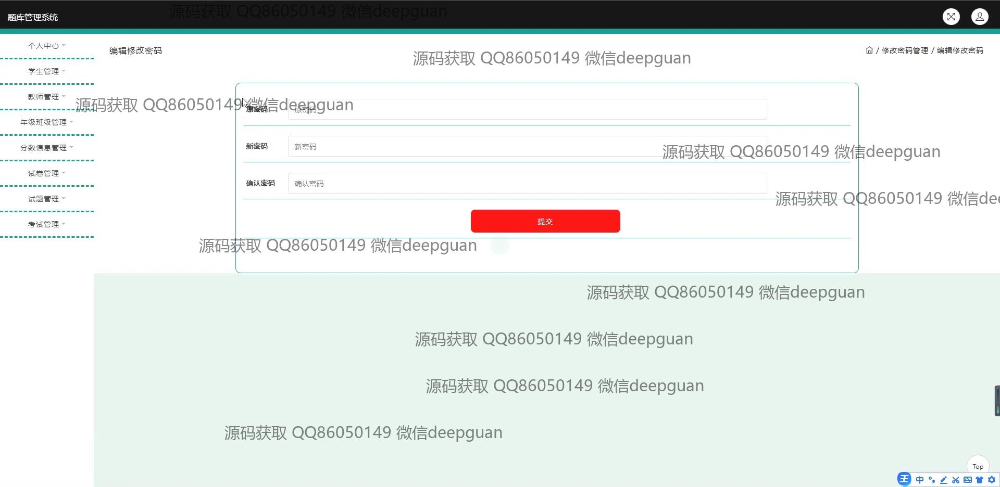

<h1 align="center">题库管理系统的设计与实现+jsp</h1>

## 简介
题库管理系统：角色分为管理员、学生、教师；功能包括用户注册、登录、试题管理、分数信息管理、考试管理、教师管理、班级管理，操作简便，适合完整题库管理流程。    --计算机毕业设计源码；毕设源码；java毕业设计源码

## 联系方式

<h3 align="center">获取完整代码与数据库文件 + 微信：deepguan QQ: 86050149 QQ群: 783742310</h3>

<h3 align="center">可帮忙远程部署 包运行成功！提供远程部署、修改代码、设计文档指导、代码讲解等服务！</h3>

## 功能介绍（完整见运行截图）
管理员：具备完整的用户信息管理功能，包括学生、教师和考试的管理，支持对班级和年级的信息管理，可执行对试题和试卷的开设、编辑与删除操作。管理员可通过系统实现对整个题库的组织、维护，确保考试及题库信息的准确性与及时更新。

教师：可以进行试题的添加和试卷的编辑，包括选择题型、分数设置以及添加题目解析等功能。教师还可管理并更新个人信息，查看及调整学生的成绩信息。系统提供用于发布和管理考试的工具，实时监控学生考试情况及收集考核结果。

学生：注册并登录后，学生可参加在线考试，并查看考试结果和个人积分信息。系统提供学生信息查询及成绩管理的便捷方式，并允许学生查看和修改自己的注册信息。学生用户还可通过导航功能访问个人中心查看学业相关信息。

用户：系统支持基本的注册、登录等用户身份管理功能，通过界面提供便捷的身份验证并进入相应模块。为提升用户体验，系统具备直观的功能菜单和导航选项，帮助管理个人账户信息及进行针对性操作。

## 运行截图

本代码来源于网络,仅供学习参考使用!

